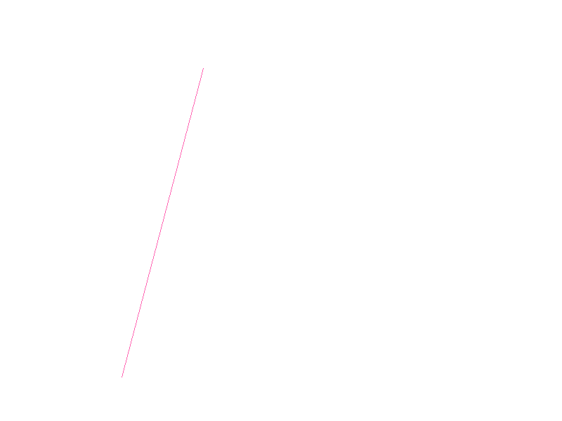

# Ejercicio de Bresenham

Implementacion de algoritmos para dibujar lineas sobre un framebuffer y guardar el resultado como imagen BMP.

## Como ejecutar

```powershell
cargo run
```

Al ejecutar el programa se generan estas imagenes:

- `pendiente.bmp`
- `dda.bmp`
- `bresenham.bmp`

## Pendiente


## DDA



## Bresenham


## Estructura

```text
src/
├── bmp.rs
├── framebuffer.rs
├── line.rs
└── main.rs
```

La funcion principal del ejercicio esta en `src/line.rs`:

```rust
draw_line_bresenham(...)
```

Esta version usa aritmetica entera y funciona para todos los octantes.
