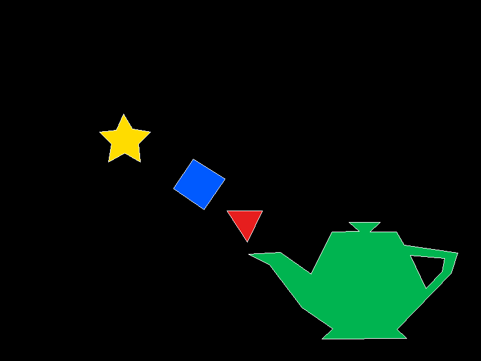

# Laboratorio 1 - Relleno de poligonos

Este laboratorio genera una imagen con varios poligonos rellenados usando Rust.

Se implemento  un algoritmo de relleno tipo scanline para los poligonos y Bresenham para dibujar las orillas. El poligono 5 se usa como agujero dentro del poligono 4.

## Ejecutar

```powershell
cargo run
```

El programa genera el archivo:

```text
out.png
```

## Resultado


